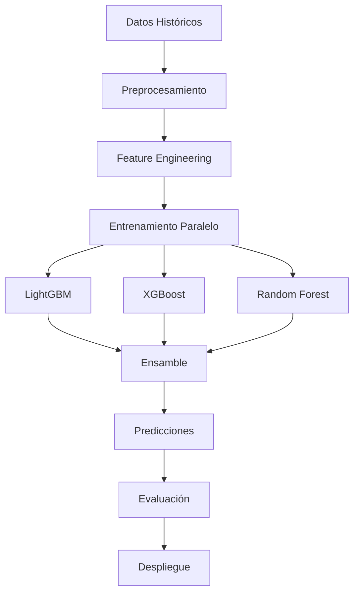

Para poder ver la pagina con todos los resultados encontrados entrar aquí: https://salud-sura-insights-dashboard.lovable.app/


# Modelo de Predicción de Demanda de Servicios de Salud SURA

## 1. Resumen Ejecutivo

Este proyecto aborda la necesidad de anticipar la demanda de servicios de salud para SURA Colombia, con el fin de optimizar la asignación de recursos y la planificación operativa. Se desarrolló un pipeline de Machine Learning para generar pronósticos a 12 meses, detallados por Municipio y Tipo de Servicio, utilizando datos históricos agregados mensualmente.

Tras un proceso iterativo de ingeniería de características, selección de modelos, entrenamiento, evaluación y corrección de errores (incluyendo la identificación y exclusión de features con *data leakage*), se obtuvo un modelo **Ensamble** (promedio de LightGBM, XGBoost y RandomForest) como el de mejor rendimiento en el conjunto de validación (datos de 2024).

El modelo final muestra una **alta precisión predictiva** (MAE ~0.62 servicios, R² ~0.9578 en validación) para la **demanda agregada mensual**, superando significativamente a un baseline simple. Sin embargo, se identificaron **limitaciones clave** relacionadas con la **falta de datos para identificar servicios laborales específicos** y la **imposibilidad de incorporar datos de capacidad de la red de prestadores** debido a inconsistencias en los identificadores de municipio entre datasets.

Las predicciones para 2025 muestran una **tendencia decreciente**, probablemente influenciada por patrones recientes observados en los datos históricos, que requiere validación experta.

**Próximos pasos cruciales:** Mejorar el preprocesamiento de datos para incluir la identificación de servicios laborales y resolver el mapeo de IDs para incorporar datos de capacidad.

## 2. Objetivo del Proyecto

**Problema:** La variabilidad en la demanda de servicios de salud dificulta la planificación eficiente de recursos (personal médico, insumos, camas, etc.). Una predicción imprecisa puede llevar a sobrecostos o a una atención deficiente.

**Objetivo General:** Desarrollar un sistema de modelos de Machine Learning capaces de predecir la demanda de servicios de salud con 12 meses de antelación.

**Objetivos Específicos:**

* Generar predicciones mensuales de la cantidad de servicios (`Service_Count`).
* Desglosar las predicciones por `Municipio` y `Tipo de Servicio`.
* Incorporar la influencia de factores como tendencias históricas, estacionalidad y características específicas de cada serie (Municipio-Servicio).
* Específicamente intentar predecir la demanda de servicios derivados de **Accidentes de Trabajo y Enfermedades Laborales (ATEL)**. *(Nota: Este objetivo no se pudo cumplir completamente por limitaciones en los datos actuales)*.
* Evaluar rigurosamente la precisión y robustez de los modelos.

## 3. Datos Utilizados

Se trabajó con tres fuentes de datos principales:

1.  **`muestra_salud_.csv`**: Dataset reducido del orignal (~11 millones de registros en el original) con detalles de atenciones individuales. **Fuente Primaria.**
2.  **`healthcare_train_data.csv` / `healthcare_valid_data.csv`**: Datasets derivados del anterior, **agregados mensualmente** por `Municipio` (originado de `Nombre_Municipio_IPS`) y `Service_Type` (originado de `Nombre_Tipo_Atencion_Arp`). Contienen ~14,000 filas en total y fueron la **base para el modelado**.
    * **Target:** `Service_Count` (conteo de atenciones/siniestros por grupo/mes).
    * **Impacto de Agregación:** Esta agregación mensual es **necesaria para el objetivo de forecasting mensual**, pero **pierde la granularidad diaria/semanal** y suaviza la variabilidad. Los modelos predicen la **tendencia agregada mensual**, no eventos diarios.
3.  **`2.Red Prestadores.xlsx`**: Información de IPS, incluyendo `Geogra_Municipio_Id` y `max_cantidad` (potencial indicador de capacidad).
## 4. Preprocesamiento e Ingeniería de Características (Sobre Datos Agregados)

Se aplicaron diversas técnicas para preparar los datos agregados y crear features relevantes para los modelos de series de tiempo:

* **Target (`Service_Count`):** Número de servicios por Municipio/TipoServicio/Mes.
* **Features Temporales:**
    * `Date`: Primer día del mes (convertido a datetime).
    * `Year`, `Month`, `Quarter`, `Month_of_Year`: Extraídos de `Date`.
    * `Year_Fraction`: Para capturar tendencia anual fraccionada.
    * **Ciclos (Sin/Cos):** `Month_sin/cos`, `Quarter_sin/cos`. **Rationale:** Ayudan a los modelos (especialmente los basados en árboles) a entender la naturaleza cíclica de la estacionalidad mensual y trimestral de forma continua.
* **Encoding Categórico:** `Municipality_encoded`, `Service_Type_encoded`. **Rationale:** Convertir identificadores de texto a números para que los modelos puedan procesarlos. Se usó `LabelEncoder`. Se crearon diccionarios (`decoders.joblib`) para mapear de vuelta a nombres originales.
* **Features de Lags:** `Service_Count_lag_X` (X=1, 2, 3, 6, 12). **Rationale:** La demanda pasada es un predictor muy fuerte de la demanda futura (autocorrelación). Se incluyeron lags de corto y mediano plazo, y el lag anual (12). NaNs iniciales rellenados con 0.
* **Features Rolling Statistics:** `Service_Count_rolling_mean/std_X` (X=6, 12 - se quitaron las de ventana 3 para reducir posible sobreajuste a ruido). **Rationale:** Capturan la tendencia local (media móvil) y la volatilidad reciente (desviación estándar móvil).
    * **¡Advertencia Leakage Potencial!**: El código de preproc. original calcula rolling stats incluyendo el mes actual. **Rationale (Corrección Sugerida):** Se debe usar `.shift(1).rolling(...)` o `rolling(..., closed='left')` para asegurar que solo se usa información pasada, evitando inflar artificialmente el rendimiento.
* **Features de Crecimiento:** `Growth_Rate_MoM`, `Growth_Rate_YoY`. **Rationale:** Capturan cambios relativos mes a mes y año a año, útiles para detectar aceleraciones o desaceleraciones. Se calculan con `.pct_change()`.
* **Features de Historial:** `Days_Since_First_Service`, `Month_Sequence`. **Rationale:** Capturan la "edad" o madurez de cada serie individual (combinación Municipio-Servicio).
* **Features de Incapacidad:** `Mean/Median/Total_Incapacity_Days`. **Rationale:** La duración de las incapacidades podría estar correlacionada con la demanda futura o la severidad de los casos. Imputación de NaNs realizada.
* **Features Excluidas (Leakage):**
    * `Days_From_Now`: **Razón:** Usaba `pd.Timestamp.now()`, introduciendo conocimiento del futuro en datos históricos.
    * `Is_Anomaly`: **Razón:** Calculada usando media/std de *toda* la serie histórica del grupo, violando la dependencia temporal.
* **Features Omitidas (Datos/Mapeo):**
    * `Is_Work_Related`: **Razón:** No se encontraron keywords relevantes en `Service_Type` agregado. **Requiere crearse en preproc desde `Nombre_Tipo_Atencion_Arp`**.
    * Features de Capacidad (`max_cantidad`, etc.): **Razón:** Imposible unir por IDs de municipio incompatibles. **Requiere mapeo `Geogra_Municipio_Id` <-> `Municipality_encoded`**.

## 5. Transformación del Target (Log1p)

* **Problema:** Los datos de conteo/demanda a menudo tienen una distribución asimétrica (skewed), con muchos valores bajos y algunos muy altos, lo que puede afectar negativamente a modelos sensibles a errores grandes (como los que usan RMSE).
* **Solución:** Se aplicó `np.log1p` (logaritmo natural de 1 + x) al target `Service_Count`.
* **Rationale:** Esta transformación comprime el rango de la variable objetivo, reduce la asimetría y estabiliza la varianza, ayudando a los modelos a aprender patrones de forma más robusta y a cumplir mejor los supuestos de algunos algoritmos (aunque los modelos de árbol son menos sensibles a esto).
* **Implementación:** Se entrenó sobre `log1p(y)`, y las predicciones se invirtieron con `np.expm1` antes de evaluar métricas y presentar resultados.

## 6. Selección y Entrenamiento de Modelos

* **Modelos Base:** Se eligieron **LightGBM**, **XGBoost** (Gradient Boosting) y **Random Forest** (Bagging).
    * **Rationale:** Son algoritmos potentes y ampliamente usados para datos tabulares, manejan bien distintos tipos de features (numéricas, categóricas), capturan interacciones y no linealidades, y tienen mecanismos contra el overfitting.
* **Ensamble:** Se promediaron las predicciones de los modelos base entrenados.
    * **Rationale:** Los ensambles suelen ser más robustos y generalizar mejor que los modelos individuales, reduciendo la varianza de la predicción.
* **Entrenamiento:** Sobre `train_df` (datos hasta 2023).
* **Validación:** Evaluación sobre `valid_df` (datos de 2024) para simular rendimiento en datos futuros no vistos.
* **Control Overfitting:**
    * **Regularización:** Uso de parámetros como `lambda_l1`, `lambda_l2`, `gamma`, `min_child_samples`, `max_depth`, `feature_fraction`, `bagging_fraction`.
    * **Early Stopping:** Detener entrenamiento de LGBM/XGB si la métrica en validación no mejora.
    * **Tuning (RF):** `RandomizedSearchCV` con `TimeSeriesSplit` para explorar hiperparámetros de RF. Se limitó `max_depth` a 25 como precaución adicional.

## 7. Evaluación del Modelo

* **Métricas:** MAE (error interpretable), RMSE (penaliza errores grandes), R² (varianza explicada).
* **Resultados Validación (v13 - Escala Original, Sin Capacidad, Sin Leaky):**

| Modelo       | MAE    | RMSE   | R2     |
| :----------- | :----- | :----- | :----- |
| LightGBM     | 0.6183 | 5.1097 | 0.9245 |
| XGBoost      | 0.9077 | 6.8716 | 0.8932 |
| RandomForest | 0.6650 | 4.9433 | 0.9048 |
| **Ensamble** | **0.6179** | **4.8295** | **0.9578** |

* **Mejor Modelo:** **Ensamble** (ligeramente superior en MAE). LGBM muy competitivo.
* **El MAE bajo (< 1 servicio) es un indicador práctico positivo.**
* **Test vs Naive:** Wilcoxon test (p <<< 0.05) confirma que el Ensamble **aporta valor significativo** sobre una predicción simple.

## 8. Análisis de Resultados y Gráficas

* **Diagnóstico Visual:** Se generaron múltiples gráficas para entender el rendimiento:
    * **Scatter Real vs Pred:** Buena alineación general.
    * **TS Agregada:** Seguimiento cercano de la tendencia real en validación.
    * **TS Ejemplo (Med-Amb):** Captura forma general pero suaviza picos (esperado). MAE específico calculado.
    * **Intervalos Quantile:** Dan una idea de la incertidumbre de la predicción agregada.
    * **Historial GrowthRate MoM:** Muestra tendencia negativa reciente que influye en predicción futura.
    * **Residuos Agregados:** **Fundamental revisarla:** buscar patrones (tendencia, estacionalidad) que indiquen sesgos del modelo. Idealmente, deben ser ruido blanco alrededor de cero.
    * **Mejores/Peores Series:** Ayudan a identificar dónde el modelo funciona excepcionalmente bien o mal.
    * **Importancia Features:** Lags y Rolling Means consistentemente importantes (XGB/RF). LGBM valora más Municipio y GrowthRate MoM. Incapacidad tiene alguna relevancia.
* **Tendencia Futura:** La predicción descendente para 2025 es una **extrapolación de la tendencia negativa reciente** observada en los datos (ver plot GrowthRate MoM). **Requiere validación experta.**

## 9. Implementación Matematica

### Modelo de predicción
ŷ(t) = β₀ + Σ[βᵢ·xᵢ(t)] + γ·s(t) + ε(t)

Donde:
- ŷ(t): Predicción en tiempo t
- β₀: Término de intercepción
- xᵢ(t): Features temporales (lags, medias móviles)
- s(t): Componente estacional (Fourier)
- ε(t): Término de error

### Transformación Logarítmica

```python
# Transformación para normalizar distribución
y_transformed = np.log1p(y_original)

# Transformación inversa para predicciones finales
y_pred_original = np.expm1(y_pred_transformed)

# Justificación matemática:
# log1p(x) = ln(1 + x) → Estable para x ∈ [0, ∞)
# expm1(x) = eˣ - 1   → Inversa exacta
```
### Descomposición Temporal
```python
# Componentes cíclicos para patrones estacionales
df['month_sin'] = np.sin(2 * np.pi * df['month']/12)
df['month_cos'] = np.cos(2 * np.pi * df['month']/12)

# Teoría subyacente:
# Cualquier función periódica puede representarse como:
# f(t) = a₀ + Σ[aₙ·cos(nωt) + bₙ·sin(nωt)]
# donde ω = 2π/T (frecuencia angular fundamental)
```

### Arquitectura del Modelo

## 10. Predicción Futura e Implementación

* **Método Iterativo:** Esencial para generar predicciones cuando hay features que dependen de lags recientes (como lag 1, rolling mean 3/6, growth rates). Se predice mes t+1, se usa para calcular features de t+2, etc.
* **Implementación:**
    * Se usó un bucle `for` sobre los 12 meses futuros.
    * La función `generate_future_features` recalculó todas las features para cada mes futuro, usando el historial `all_predictions_df` (que se actualiza con cada nueva predicción).
    * Se corrigió el método de obtención de lags usando `.map()` sobre un MultiIndex para evitar errores de `pd.merge`.
* **Salidas:**
    * Modelos `.joblib`.
    * Decoders `.joblib`.
    * CSV detallado futuro.
    * JSON con métricas y resúmenes.

**Conclusión Final (Estado Actual):** Se ha desarrollado un pipeline robusto que produce predicciones mensuales agregadas con alta precisión estadística en los datos de validación, superando un baseline simple. Se han identificado y mitigado problemas de data leakage. Sin embargo, el cumplimiento completo de los requisitos (detalle laboral) y la incorporación de información contextual clave (capacidad de red) dependen críticamente de **mejoras en el preprocesamiento y la disponibilidad de datos/mapeos adicionales.**
